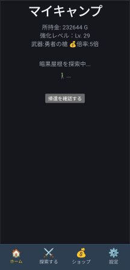
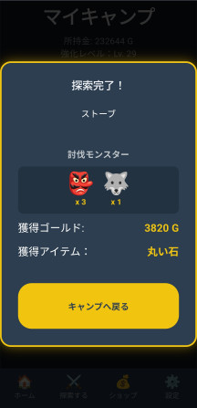
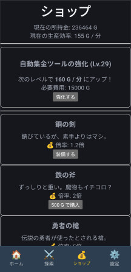

# AUTO-EXPLORER-RPG

|  |  |  |
| :---: | :---: | :---: |
| HOME | Explorer completed | Shop |

- *UI is currently under development and subject to change.*
- Note: Screenshots are from a work-in-progress version.
---

## OVERVIEW

### Idle & Explore Game App
- **Idle Rewards :** Earn in-game currency based on time spent away from the app.
- **Exploration :** Embark on adventures to gain area-specific currency and item rewards.
- **Trading :** Fully functional shop system for buying and selling items.
- **Data Management :** Export and import save data via JSON for easy backup.
- **Automated Testing with Vitest :**
    - Complicated Logic against with state transition(State mutation), construction robust test case with 'act'.
    - Constructed robust test cases using act to validate complex state mutations and business logic (e.g., weapon purchasing and equipment systems).

### A project designed to practice and master React & TypeScript.
This project is built to demonstrate and refine proficiency in **"React and TypeScript"**:
- **Architecture :** Practicing clean directory structures and modularizing logic (hooks, components, context).
- **State Management :** Implementing global state using the **"Context API"**.
- **Future Roadmap :** 
    - Automated testing with **"Vitest"**.
    - Advanced state management with **"Zustand"** (Planned).

---

## プロジェクト概要

### 放置 & 探索ゲームアプリ
- **放置報酬 :** アプリから離れていた時間に応じて通貨を獲得する。
- **探索要素 :** エリアを選択して探索を行い、エリアに応じた時間経過で成果（通貨、アイテム）を獲得。
- **ショップ :** 装備の購入、アイテム売却を行うゲーム内経済。
- **データ管理 :** JSON形式でのセーブデータ書き出し、読み込み機能。
- **Automated Testing:**
    - **Vitest** を用いた単体テストの実装。
    - `renderHook` を活用し、`GameContext` と連携した Custom Hooks（武器購入・装備ロジック等）の動作を網羅。
    - 状態遷移（State mutation）が伴う複雑なロジックに対し、`act` を用いた堅牢なテストケースを構築。

### 技術的な目標
TypeScript・React を用いた **「実務に近い設計」** を目標としたプロジェクト
- **メンテナンス性 :** 役割ごとにファイルを分割（hooks、components など）、一目でわかる構成を目指す。
- **状態管理 :** Context API を使用したプロパティのバケツリレーを防ぐクリーンなデータフローを目指す。
- **今後の展望 :**
    - **Vitest** を使用した単体テストの実装
    - **Zustand** へのリファクタリングによる、より高度な状態管理の学習（予定）
